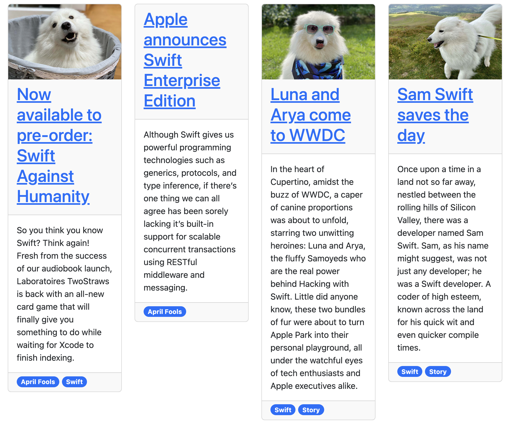

# Ignite 라이브러리의 ContentPreview라는 Component에 CustomStyle 추가한 경험

Static Website를 구현하는데 도움을 주는 Ignite 라이브러리에서 ContentPreview라는 Component가 있습니다. 해당 Component는 Content 폴더에 존재하는 모든 마크다운문서를 List로 표시하는데 편리하게 사용가능한 Component입니다.

하지만 ContentPreview에는 Layout이 지정되어 있어 Custom이 불가능했습니다. 따라서 클로저 프로퍼티를 통해 Custom을 원하는 경우 Custom이 가능하도록 기능을 추가했습니다.

### 스크린샷


### 변경내용
```swift
import Foundation

/// A wrapper around Card, specifically aimed at presenting details about
/// some content on your site. This automatically links to your content page
/// and adds in tags.
public struct ContentPreview: BlockElement {
    var content: Content

    /// The standard set of control attributes for HTML elements.
    public var attributes = CoreAttributes()

    /// How many columns this should occupy when placed in a section.
    public var columnWidth = ColumnWidth.automatic

    /// The layout block element for rendering the preview. Defaults to a card if not provided.
    public var customLayout: ((Content) -> BlockElement)?

    /// Initializes the content preview with an optional custom layout.
    /// - Parameters:
    ///   - content: The content to display.
    ///   - customLayout: An optional closure for custom layout.
    public init(for content: Content, customLayout: ((Content) -> BlockElement)? = nil) {
        self.content = content
        self.customLayout = customLayout
    }

    /// Renders the content preview with either a custom layout or the default card.
    /// - Parameter context: The publishing context for rendering.
    /// - Returns: A rendered string of HTML.
    public func render(context: PublishingContext) -> String {
        // Rendering using either custom layout or default card layout.
        if let customLayout {
            return customLayout(content)
                .attributes(attributes)
                .render(context: context)
        } else {
            return defaultCardLayout(context: context)
                .attributes(attributes)
                .render(context: context)
        }
    }

    /// Default card layout for rendering the content preview.
    /// - Parameter context: The publishing context for rendering tag links.
    /// - Returns: A BlockElement representing the card layout.
    private func defaultCardLayout(context: PublishingContext) -> BlockElement {
        Card(imageName: content.image) {
            Text(content.description)
                .margin(.bottom, .none)
        } header: {
            Text {
                Link(content)
            }
            .font(.title2)
        } footer: {
            let tagLinks = content.tagLinks(in: context)

            if !tagLinks.isEmpty {
                Group {
                    tagLinks
                }
                .style("margin-top: -5px")
            }
        }
    }
    
}
```

### 링크
- [Pull Request Link](https://github.com/twostraws/Ignite/pull/129)
